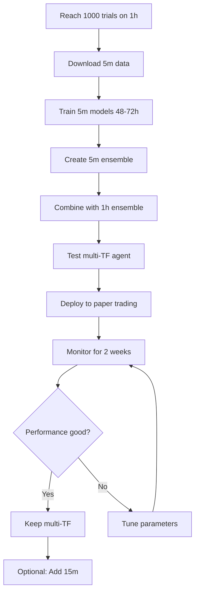

# Multi-Timeframe Ensemble Trading System

Complete system for combining multiple timeframes to improve entry/exit timing in crypto trading.

---

## 🎯 Goal

Enhance the existing 1-hour ensemble with shorter timeframes (5m, 15m) to:
- **Improve entry timing**: Wait for optimal price points within the hour
- **Reduce slippage**: Execute at better prices
- **Increase returns**: Estimated +0.6-1.0% improvement
- **Reduce drawdowns**: ~20-30% smaller pullbacks

---

## 📊 Current Status

**Your Progress:**
```
Completed Trials: 757 / 1000
Remaining: 243 trials
Best Value: 0.012626
Top 10%: 79 models

Estimated Time: ~40 hours (~1.7 days)
```

**When to Start:**
✅ Launch multi-timeframe training **after reaching 1000 trials**

---

## 🏗️ Architecture

```
                Multi-Timeframe Ensemble
                        │
        ┌───────────────┴───────────────┐
        │                               │
   Strategic Layer                 Tactical Layer
   (1h timeframe)                 (5m/15m timeframe)
        │                               │
    Direction &                     Entry/Exit
    Position Size                      Timing
        │                               │
        └───────────┬───────────────────┘
                    │
              Final Decision
```

**Strategic Layer (1h):**
- Trained on 1 year of data
- 10 best models from 1000 trials
- Determines WHAT to trade and HOW MUCH
- Focuses on long-term patterns

**Tactical Layer (5m/15m):**
- Trained on 3-6 months of data
- 5-10 models per timeframe
- Determines WHEN to enter/exit
- Focuses on short-term momentum

**Combination Strategy:**
- Strategic decides direction (BUY/SELL/HOLD)
- Tactical refines timing within that direction
- Only execute when both align and momentum is good

---

## 📁 Files Created

### Scripts
1. **`prepare_multi_timeframe_data.py`** - Download and prepare short TF data
2. **`train_multi_timeframe.sh`** - Launch training for 5m/15m/30m
3. **`multi_timeframe_ensemble_agent.py`** - Agent combining multiple TFs

### Documentation
1. **`MULTI_TIMEFRAME_STRATEGY.md`** - Complete strategy guide (11 KB)
2. **`MULTI_TIMEFRAME_LAUNCH_GUIDE.md`** - Step-by-step implementation (9 KB)
3. **`README_MULTI_TIMEFRAME.md`** - This file

---

## 🚀 Quick Start (When You Hit 1000 Trials)

### Day 1: Prepare Data
```bash
# Download 5-minute data (3 months)
python prepare_multi_timeframe_data.py --timeframe 5m --months 3
# Duration: 4-6 hours
```

### Days 2-4: Train Models
```bash
# Train 5m models with 24 workers
./train_multi_timeframe.sh --timeframe 5m --workers 24 --trials 500
# Duration: 48-72 hours
```

### Day 5: Create Ensemble
```bash
# Get study name
STUDY=$(sqlite3 databases/optuna_cappuccino.db \
  "SELECT study_name FROM studies WHERE study_name LIKE 'cappuccino_5m%' \
   ORDER BY study_id DESC LIMIT 1")

# Create ensemble
python create_simple_ensemble.py \
  --study $STUDY \
  --output-dir train_results/ensemble_5m
```

### Day 5: Test & Deploy
```bash
# Test ensemble
python multi_timeframe_ensemble_agent.py

# View results in dashboard
python dashboard.py
# Navigate with arrow keys to see ensemble votes
```

---

## 💡 How It Works

### Example: BTC Buy Signal

**Without Multi-TF (1h only):**
```
14:00 → Signal: BUY BTC
        Execute immediately at $87,000
        Price drops to $86,500 by 14:30
        Entry could have been better
```

**With Multi-TF (1h + 5m):**
```
14:00 → Strategic (1h): BUY BTC
        Tactical (5m): Detects downward momentum → WAIT

14:15 → Tactical (5m): Support found, momentum turning → ENTER
        Execute at $86,650

Improvement: +$350 (0.40%)
```

**Result:** Better entry timing without changing overall strategy.

---

## 📈 Expected Improvements

| Metric | Before (1h only) | After (Multi-TF) | Improvement |
|--------|------------------|------------------|-------------|
| Entry timing | Variable | Optimized | +0.3-0.5% |
| Exit timing | Variable | Optimized | +0.3-0.5% |
| Overall returns | Baseline | Enhanced | +0.6-1.0% |
| Max drawdown | Baseline | Reduced | -20-30% |
| Win rate | Baseline | Higher | +2-5% |
| Sharpe ratio | Baseline | Improved | +10-20% |

---

## 🎓 Documentation Guide

### For Strategy Understanding
Read: **`MULTI_TIMEFRAME_STRATEGY.md`**
- Architecture diagrams
- Signal combination strategies
- Resource requirements
- Timeline and planning

### For Implementation
Read: **`MULTI_TIMEFRAME_LAUNCH_GUIDE.md`**
- Step-by-step instructions
- Command examples
- Troubleshooting
- Monitoring checklist

### For Quick Reference
Read: **This file (README_MULTI_TIMEFRAME.md)**
- Overview and status
- Quick start commands
- Key concepts

---

## ⚙️ Resource Requirements

### Disk Space
- 1h data: ~1.5 GB (already have ✓)
- 5m data: ~1-2 GB
- 15m data: ~0.8-1.5 GB
- **Total: ~10 GB**

### GPU
- Training 5m: 48-72 hours with 24 workers
- Can use same GPU as 1h training (reduce 1h workers)
- Or split across multiple GPUs

### Time
- **Data prep**: 4-6 hours
- **Training**: 48-72 hours
- **Setup**: 4-8 hours
- **Total**: ~3-4 days from start to deployment

---

## 🎯 Success Metrics

Track these after deployment:

### Minimum Success (Keep Current Performance)
- No degradation vs 1h-only
- System runs stably

### Good Success (+0.5-1.0%)
- Measurable improvement in returns
- Lower drawdowns
- Better entry timing visible

### Excellent Success (+1.0-2.0%)
- Significant outperformance
- Consistently better entries/exits
- Higher Sharpe ratio

---

## 🔄 Workflow



---

## 🛠️ Available Commands

```bash
# Check current progress
sqlite3 databases/optuna_cappuccino.db \
  "SELECT COUNT(*) FROM trials WHERE state='COMPLETE'"

# Prepare data
python prepare_multi_timeframe_data.py --timeframe 5m --months 3

# Train models
./train_multi_timeframe.sh --timeframe 5m --workers 24 --trials 500

# Monitor training
watch -n 10 'pgrep -f "study-name cappuccino_5m" | wc -l'

# Create ensemble
python create_simple_ensemble.py --study <5m_study> --output-dir train_results/ensemble_5m

# Test ensemble
python multi_timeframe_ensemble_agent.py

# View dashboard
python dashboard.py
```

---

## 📝 Key Concepts

### 1. **Time Separation**
- Strategic (1h): "Should I buy BTC?"
- Tactical (5m): "Now is a good time"

### 2. **Signal Alignment**
- Both timeframes agree → Execute
- Timeframes conflict → Wait or reduce size

### 3. **Momentum Detection**
- 5m models detect short-term momentum
- Helps avoid buying at local peaks
- Improves fill prices

### 4. **Risk Management**
- Same position limits (30% max)
- Same stop-loss (10%)
- Additional: wait for alignment

---

## 🚨 Important Notes

1. **Don't rush**: Wait until 1000 trials complete
2. **Test first**: Use paper trading, not live
3. **Compare objectively**: Track metrics, not feelings
4. **Keep 1h running**: Don't stop 1h training entirely
5. **Start with 5m**: Add 15m later if 5m works well

---

## 📞 Next Steps

**Right Now (before 1000 trials):**
1. ✅ Keep 1h training running (243 trials remaining)
2. ✅ Monitor current paper trading performance
3. ✅ Read documentation
4. ✅ Plan resource allocation

**At 1000 Trials:**
1. 🎯 Evaluate 1h ensemble performance
2. 🎯 Select best 10-20 models
3. 🎯 Update 1h ensemble if needed
4. 🎯 Begin 5m data preparation

**After 5m Training:**
1. 🚀 Create multi-TF ensemble
2. 🚀 Test thoroughly
3. 🚀 Deploy to paper trading
4. 🚀 Monitor and optimize

---

## 📚 Related Documentation

- `MULTI_TIMEFRAME_STRATEGY.md` - Detailed strategy explanation
- `MULTI_TIMEFRAME_LAUNCH_GUIDE.md` - Complete implementation guide
- `ENSEMBLE_VOTING_GUIDE.md` - Understanding model voting
- `DASHBOARD_NAVIGATION.md` - Dashboard user guide
- `PORTFOLIO_FORECAST_GUIDE.md` - Portfolio analysis

---

## 🎉 Summary

You're building a sophisticated multi-timeframe trading system that:
- Uses 1h models for strategic direction
- Uses 5m/15m models for tactical timing
- Combines signals intelligently
- Aims to improve returns by 0.6-1.0%+

**Current Status:** 757/1000 trials complete (~76%)

**Next Milestone:** Reach 1000 trials, then launch multi-TF training!

**Timeline to Multi-TF Trading:** ~5-7 days from 1000 trials

---

**Questions? Check the detailed guides or test the scripts with `--help` flag.**

Good luck! 🚀
